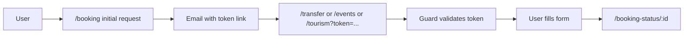

# KtransportFE

Frontend for **Ktransport** — premium transport, airport transfers, and corporate chauffeur services in the Île-de-France region and the French Riviera. Users can request quotes, complete a token-based booking flow, and view booking status.

**Package name:** `ktransport-angular`

---

## Tech stack

- **Framework:** Angular 17 (standalone components, no NgModules)
- **UI:** Angular Material 17, SCSS, Tailwind (devDependency)
- **State/HTTP:** RxJS, `HttpClient` with interceptors
- **Config:** Runtime config from [src/assets/config.json](src/assets/config.json) via [ConfigService](src/app/core/services/config.service.ts) — no build-time environment variables

---

## Repository structure

| Area | Location | Description |
|------|----------|-------------|
| Entry | [src/main.ts](src/main.ts), [src/app/app.config.ts](src/app/app.config.ts) | Bootstrap, routes, HttpClient, mock interceptor |
| Routes | [src/app/app.routes.ts](src/app/app.routes.ts) | All routes under `MainLayoutComponent` |
| Layout | [src/app/layouts/main-layout/](src/app/layouts/main-layout/) | Navbar + router outlet + footer |
| Pages | [src/app/pages/](src/app/pages/) | home, about, services, fleet, chauffeurs, contact, partnerships, events, tourism, transfer, booking, booking-status, booking-error |
| Shared | [src/app/components/](src/app/components/) | navbar, footer, loader |
| Core | [src/app/core/services/](src/app/core/services/), [src/app/guards/](src/app/guards/), [src/app/directives/](src/app/directives/) | Services, route guards, directives |
| Assets | [src/assets/](src/assets/) | `config.json`, `translations.json`, [email-templates](src/assets/email-templates/) (see its README) |

**Key routes:** `/`, `/booking`, `/booking/:serviceType`, `/booking-status/:bookingId`, `/booking-error`, `/transfer`, `/events`, `/tourism`, `/chauffeurs`, `/contact`, `/services`, `/fleet`, `/about`, `/partnerships`.

---

## Configuration

- **Backend and features:** [src/assets/config.json](src/assets/config.json) defines `backend.apiUrl`, contact/whatsapp, flight API (aviationstack / opensky / amadeus), and map defaults. [ConfigService](src/app/core/services/config.service.ts) loads it once and caches it. The backend API is expected at `backend.apiUrl` (e.g. `https://api.ktransport.online`); booking and form endpoints are defined by that API.
- **i18n:** [src/assets/translations.json](src/assets/translations.json) holds `en` and `fr`. [I18nService](src/app/core/services/i18n.service.ts) loads translations and exposes `language$`; language is stored in `localStorage` and can follow browser preference.
- **Theme:** [ThemeService](src/app/core/services/theme.service.ts) manages light/dark mode (localStorage and `prefers-color-scheme`).

---

## Booking flow

1. **Gateway:** User chooses a service (e.g. from [ServicesComponent](src/app/pages/services/services.component.html)) and goes to `/booking` with `?service=...` or `/booking/:serviceType`. [BookingComponent](src/app/pages/booking/booking.component.ts) submits an **initial request** (name, email, phone, preferred contact, service type) to the backend.
2. **Token link:** Backend sends an email with a link such as `/transfer?token=...` (or `/events`, `/tourism`). [bookingTokenGuard](src/app/guards/booking-token.guard.ts) validates the token via [BookingService](src/app/core/services/booking.service.ts). If valid and unused, [BookingStateService](src/app/core/services/booking-state.service.ts) stores the booking data and the user can open the form.
3. **Guarded routes:** `/events`, `/tourism`, `/transfer` are protected by `bookingTokenGuard`; without a valid token the user is redirected to `/booking` or `/booking-error`.
4. **Completion and status:** User fills the service-specific form; completion is done via BookingService. Status is shown at `/booking-status/:bookingId` ([BookingStatusComponent](src/app/pages/booking-status/booking-status.component.ts)).

---

## Mock API

[mockApiInterceptor](src/app/core/interceptors/mock-api.interceptor.ts) is always registered. It **only** intercepts requests to **relative** URLs (e.g. `/api/v1/bookings/...`, `/api/forms/...`). Requests to **absolute** URLs (e.g. `https://api.ktransport.online/...` from config) **pass through** to the real backend. Production uses the configured backend; the mock is for local development when using relative URLs or when no backend is available.

---

## Install, run, and build

- **Prerequisites:** Node.js (compatible with Angular 17), npm.
- **Install:** `npm install`
- **Run (dev):** `npm start` — runs `ng serve --host 0.0.0.0` (accessible on the network). For localhost only: `npm run start:local` or `ng serve`.
- **Build:** `npm run build` — output in `dist/ktransport` (production by default).
- **Tests:** `npm test` (Karma).

---

## Conventions and tips for agents

- **Config:** Prefer [src/assets/config.json](src/assets/config.json) for API URL, contact details, etc., rather than introducing env vars, unless the team agrees otherwise.
- **Translations:** Add or edit keys in [src/assets/translations.json](src/assets/translations.json) under `en` and `fr`; use [I18nService](src/app/core/services/i18n.service.ts) in components for translated strings.
- **New pages:** Add the route in [src/app/app.routes.ts](src/app/app.routes.ts) and the component under `src/app/pages/`; use `MainLayoutComponent` as parent for main site pages.
- **Styles:** Global styles in [src/styles.scss](src/styles.scss); page-level hero styles in [src/styles/page-hero.scss](src/styles/page-hero.scss); component SCSS next to each component.

---

## Security

Do not commit real API keys or secrets. [src/assets/config.json](src/assets/config.json) may contain placeholders; in sensitive setups it should be overridden per environment or excluded from version control (e.g. via `.gitignore`) and replaced at deploy time.
